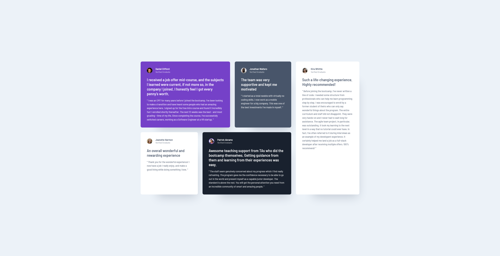

# Frontend Mentor - Testimonials grid section solution

This is a solution to the [Testimonials grid section challenge on Frontend Mentor](https://www.frontendmentor.io/challenges/testimonials-grid-section-Nnw6J7Un7). Frontend Mentor challenges help you improve your coding skills by building realistic projects.

## Table of contents

- [Overview](#overview)
  - [The challenge](#the-challenge)
  - [Screenshot](#screenshot)
  - [Links](#links)
  - [Built with](#built-with)
  - [What I learned](#what-i-learned)
- [Author](#author)

**Note: Delete this note and update the table of contents based on what sections you keep.**

## Overview

### The challenge

Users should be able to:

- View the optimal layout for the site depending on their device's screen size

### Screenshot

### Links

- Solution URL: [GitHub Repository URL](https://github.com/DarkPhoenixNinja92/Testimonials-Grid-Section)
- Live Site URL: [GitHub Pages Live Site URL](https://darkphoenixninja92.github.io/Testimonials-Grid-Section)

### Built with

- Semantic HTML5 markup
- CSS custom properties
- CSS Grid
- Mobile-first workflow

### What I learned

This was one of my first attempts to make a thing with css grid. I'm not very good at grid, for the most part, and tend to build most of my websites using flexbox and relative positioning but wanted to start learning how to grid a little better. I don't think it went that bad but I obviously have a long ay to go before becoming efficient at css grid.

## Author

- Website - [Shaun Pour](https://scpour.com)
- Frontend Mentor - [@DarkPhoenixNinja92](https://www.frontendmentor.io/profile/DarkPhoenixNinja92)
- Twitter - [@Dark_Ninja92](https://www.twitter.com/Dark_Ninja92)
